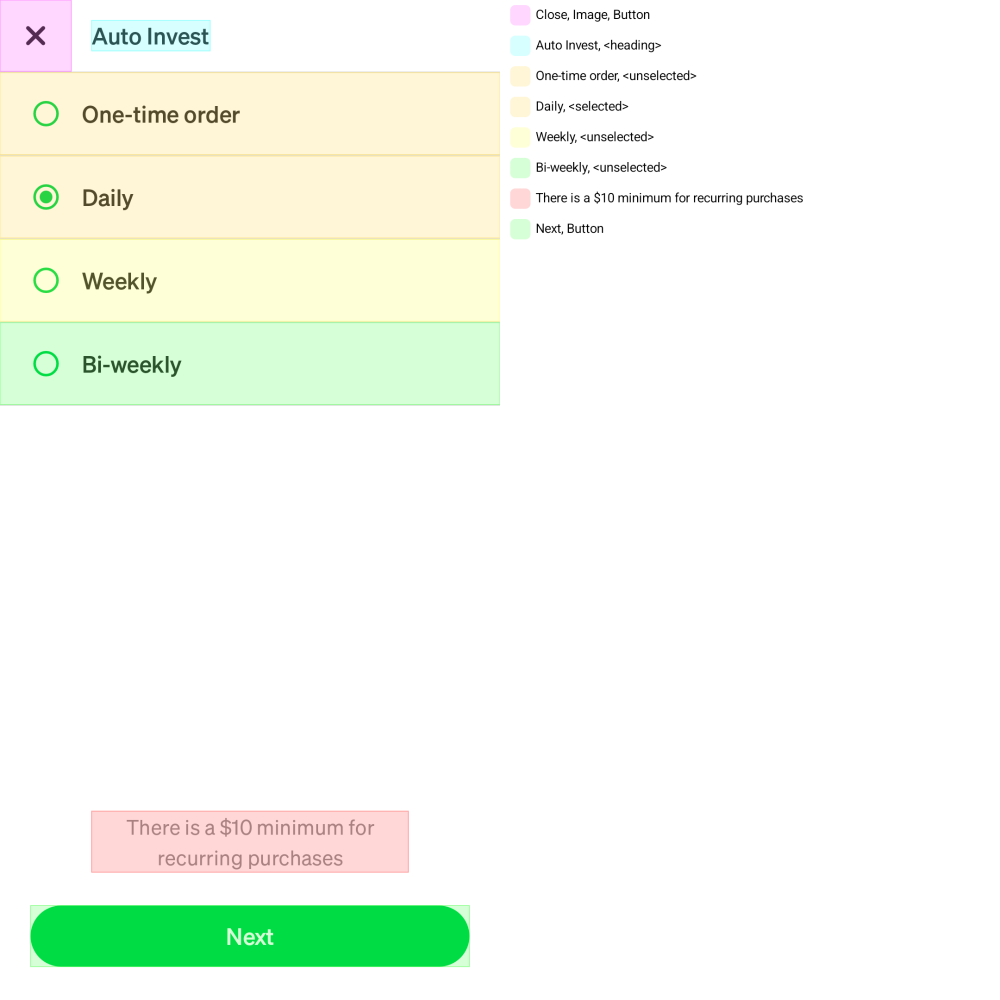

AccessibilityRenderExtension Overview
========

The `AccessibilityRenderExtension` allows accessibility properties to be visually checked alongside a snapshot of the UI under test. Like regular Paparazzi tests, tests using the `AccessibilityRenderExtension` provide a way to compare changes that update accessibility handling to “golden snapshots” that have been recorded previously. This can help catch regressions to accessibility support. The `AccessibilityRenderExtension` does **not** inform developers whether or not the accessibility properties and their content are appropriate for the specific use case of your UI. That is up to the developer writing the test to understand within the context of the UI under test (see below for some tips on how to verify this).

Set Up Guide
-------

To create an accessibility snapshot test, the only change needed compared to a regular Paparazzi test is to add the `AccessibilityRenderExtension` to the `renderExtensions` set in your Paparazzi configuration, as follows:

```kotlin
@get:Rule
val paparazzi = Paparazzi(
	// ...
	renderExtensions = setOf(AccessibilityRenderExtension()),
	// ...
)
```

Recording and verifying accessibility snapshot tests works identically to regular Paparazzi tests.

Interpreting Accessibility Snapshots
-------



Figure A: Example accessibility snapshot

The legend on the right hand side of figure A above indicates some of the properties that are available to assistive technologies (such as TalkBack). The order in which the items appear in the legend matches the order in which the screen reader will surface them to the user (in nearly all cases, they should go from start to end, top to bottom). The colors for each item in the legend match each accessibility element with its corresponding UI element. Each highlighted area is a single screen reader focusable element.

To help understand whether the accessibility property values you are seeing in your snapshots are sufficient for providing your customers with an accessible experience, referencing the [WCAG criteria](https://www.w3.org/TR/WCAG22/) is a good place to start. For example, [4.1.2 Name, Role, Value](https://www.w3.org/TR/WCAG22/#name-role-value) is a criteria that must be met for any custom component you create (standard Android components will meet this criteria by default). To pass that criteria, the name (e.g. “Submit”), role (e.g. “Button”) and value (if applicable, e.g. “Selected”), must be available to assistive technology users. You can check whether this criteria is met by verifying whether the text for each of your UI elements in the legend of your accessibility snapshots covers the name, role and value of the elements under test.

Things to Look For
-------

- **All visually available text**
    - All text you see in the UI in the left pane should also be available in the legend on the right.
- **Ordering**
    - The order of the items in the legend should make logical sense within the context of your application.
- **Visual cues**
    - Are there things represented by colors or position that aren’t communicated in the legend? Examples could be red used to represent an error without textual description or a label and value being next to each other visually, but displayed separately in the legend, losing that relationship.
- **Image descriptions**
    - Images and icons *that convey meaning* should have descriptions for them represented in the legend. On the other hand, images and icons that *don’t* convey additional meaning (Like a ✏️ icon paired with visual “Edit” text on a button `[✏️ Edit]`) shouldn’t have representation in the legend, as that would be repetitive.
- **Roles and states**
    - The correct role or state (header, button, disabled, checked, etc.) should be represented in the legend.

Currently Supported Properties
-------

- **Content Description**
    - This is the main text read out by Talkback to describe a UI element. For text based elements (i.e. `TextView` or Composable `Text`), this is likely the text content itself. For text fields this would include the content entered by users.
- **Role (Compose only)**
    - The role of an element, such as "button", "checkbox", or "image". It helps assistive technologies identify the purpose of a UI component.
- **Selected state**
    - Indicates whether an item is currently selected. For example, in a list of selectable items, the selected item will announce its state as "selected" to TalkBack users.
- **Disabled state**
    - Indicates whether an element is currently disabled and not interactive. Disabled elements are announced as "disabled" by TalkBack, signaling they are unavailable for interaction.
- **On click label (Compose only)**
    - Provides additional context to a user about what will happen when an element is activated. This label is read by TalkBack alongside the action and is especially useful for custom buttons or interactive elements.
- **Heading**
    - Marks an element as a heading for screen readers. This helps users navigate through content quickly, as headings can be used as landmarks or points of reference in a layout.
- **Toggleable state**
    - Indicates whether an element can be toggled on or off, such as a switch or a checkbox. The state (e.g. "checked" or "unchecked") is announced by TalkBack to convey its current value.
- **Error Description**
    - Provides additional context to a user about what went wrong when an error occurs. This is especially useful for form fields or other interactive elements that may have validation errors.
- **Progress**
    - Indicates the progress of an element, such as a progress bar or a loading spinner. The progress value is announced by TalkBack to inform users of the current state of the element.
- **Custom Action**
    - Custom actions allow the definition of additional interactive actions for UI elements, making them more accessible to users of assistive technologies. Links present in `AnnotatedString`'s (via `LinkAnnotation`) are another type of action that is supported.
- **Live Region**
    - A live region is a section of UI that is updated dynamically and relevant to the user. Screen readers can be configured to announce changes in live regions automatically, ensuring users are aware of updates without needing to navigate to the updated content.
- **Collection Info**
    - Indicates whether an element is in a list or not. This is helpful to let Talkback users know that they are currently navigating through a list of items which gives more context to the user that these items are related to each other rather than separate elements on the screen.
- **Editable**
    - Indicates whether an element is editable. For example, a field that allows the user to input text, Talkback will announce it is editable so the user knows this isn't just a standard text field.
