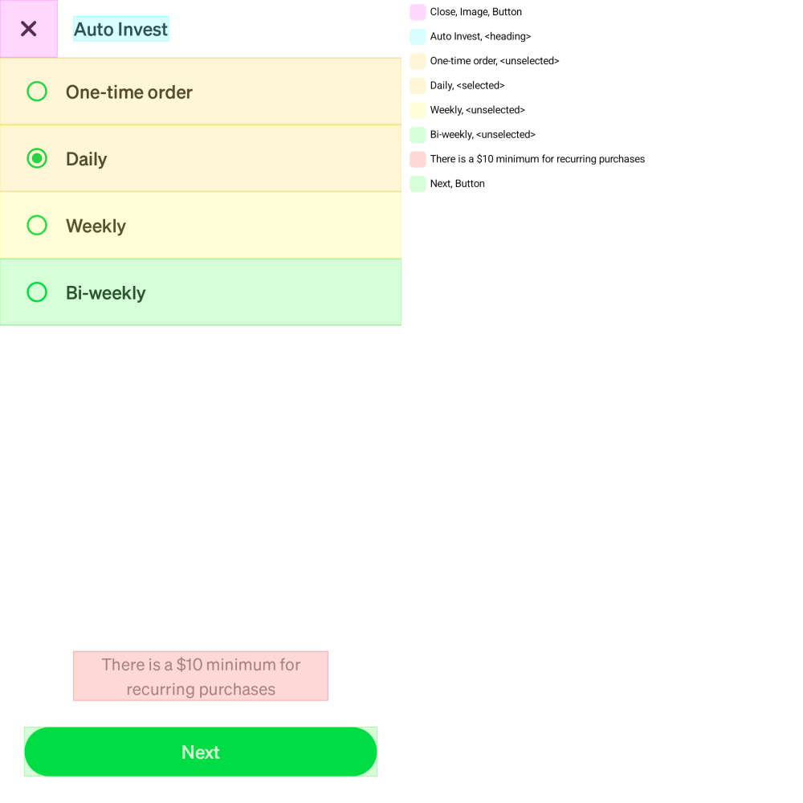

Accessibility Snapshots
========

The `AccessibilityRenderExtension` allows accessibility properties to be visually checked alongside a snapshot of the UI under test. Like regular Paparazzi tests, tests using the `AccessibilityRenderExtension` provide a way to compare changes that update accessibility handling to "golden snapshots" that have been recorded previously. This can help catch regressions to accessibility support. The `AccessibilityRenderExtension` does **not** inform developers whether or not the accessibility properties and their content are appropriate for the specific use case of your UI. That is up to the developer writing the test to understand within the context of the UI under test (see below for some tips on how to verify this).

Set Up
-------

To create an accessibility snapshot test, add the `AccessibilityRenderExtension` to the `renderExtensions` set in your Paparazzi configuration:

```kotlin
@get:Rule
val paparazzi = Paparazzi(
  renderExtensions = setOf(AccessibilityRenderExtension()),
)
```

Recording and verifying accessibility snapshot tests works identically to regular Paparazzi tests — use `./gradlew recordPaparazzi` and `./gradlew verifyPaparazzi`.

Both Android Views and Jetpack Compose content are supported. You can snapshot views, composables, or mixed hierarchies:

```kotlin
// Compose
@Test
fun composableTest() {
  paparazzi.snapshot {
    MyComposable()
  }
}

// Android View
@Test
fun viewTest() {
  val view = MyCustomView(paparazzi.context)
  paparazzi.snapshot(view)
}

// Mixed: View containing ComposeView
@Test
fun mixedTest() {
  val mixedView = MixedView(paparazzi.context)
  paparazzi.snapshot(mixedView)
}
```

### Limitations

- **`RenderingMode.SHRINK` is not supported.** Using `AccessibilityRenderExtension` with `RenderingMode.SHRINK` throws an `IllegalStateException`. See [#1350](https://github.com/cashapp/paparazzi/issues/1350) for context.
- **`validateAccessibility` is deprecated.** The older `validateAccessibility: Boolean` parameter on `Paparazzi` used Android's `LayoutValidator` for contrast checking. It has been replaced by `AccessibilityRenderExtension` and cannot be used simultaneously with render extensions.

Interpreting Snapshots
-------



Figure A: Example accessibility snapshot

Accessibility snapshots render as a **split view**: the original UI on the left, and a color-coded legend on the right.

- **Legend order** matches the order a screen reader (TalkBack) will surface elements to the user. In most cases, this should go from start to end, top to bottom.
- **Color coding** maps each legend entry to the corresponding UI element via colored rectangles overlaid on the left pane and matching color badges in the legend.
- **Each highlighted area** represents a single screen reader-focusable element.
- **Color assignment is deterministic** — colors are derived from a hash of the element's accessibility text, so they remain stable across test runs regardless of view hierarchy order.
- **Font scaling independence** — the legend text does not scale with the device's `fontScale` setting, ensuring consistent snapshot output even when testing with large font sizes.

### Snapshot labels

Each legend entry is a comma-separated string of the accessibility properties for that element. The labels use angle-bracket prefixes to distinguish property types:

| Label | Meaning |
|---|---|
| Plain text | Content description or text content |
| `<selected>` / `<unselected>` | Selection state |
| `<disabled>` | Element is not interactive |
| `<heading>` | Screen reader heading landmark |
| `<toggleable>: checked` / `not checked` / `indeterminate` | Toggle state (checkbox, switch) |
| `<on-click>: label` | Click action description (Compose only) |
| `<progress>: N%` or `<progress>: indeterminate` | Progress bar value |
| `<set-progress>: label` or `<adjustable>` | Slider/adjustable control |
| `<editable>` | Editable text field |
| `<live-region>: assertive` / `polite` | Dynamic content region |
| `<custom-action>: label` | Custom accessibility action |
| `<url-action>: text` | URL link annotation |
| `<click-action>: text` | Clickable link annotation |
| `<in-list>` | Element is inside a list/collection |
| State description text | Custom state description (replaces selected state when set) |
| Role name (e.g., `Button`, `Checkbox`, `Image`) | Semantic role (Compose only) |
| Error description text | Validation error message |

Supported Properties
-------

### Content description

The main text read by TalkBack to describe a UI element.

- **Views**: `contentDescription` or `iterableTextForAccessibility` (text content of `TextView`, etc.)
- **Compose**: `SemanticsProperties.ContentDescription`, `SemanticsProperties.Text`, or `SemanticsProperties.EditableText`

For merged semantics nodes (e.g., a `Row` with `mergeDescendants = true`), child node text is collected and joined with commas.

### Role (Compose only)

The semantic role of an element — `Button`, `Checkbox`, `Image`, `Switch`, `Tab`, `RadioButton`, etc. Helps assistive technologies identify the purpose of a UI component.

```kotlin
Box(modifier = Modifier.semantics { role = Role.Button }) {
  Text("Submit")
}
```

### Selected state

Indicates whether an item is currently selected. Renders as `<selected>` or `<unselected>`.

**Note:** If a `stateDescription` is set, the selected state is suppressed, because TalkBack only reads one or the other.

### Disabled state

Renders as `<disabled>` for non-interactive elements. When an element is disabled, click labels are also suppressed (matching TalkBack behavior).

- **Views**: `isEnabled == false`
- **Compose**: `SemanticsProperties.Disabled`

### On-click label (Compose only)

Provides context about what happens when an element is activated. Renders as `<on-click>: label`.

```kotlin
Box(modifier = Modifier.clickable(onClickLabel = "Add to cart") { }) {
  Text("Product")
}
```

### Heading

Marks an element as a heading landmark for screen reader navigation. Renders as `<heading>`.

- **Views**: `isAccessibilityHeading = true` (API 28+)
- **Compose**: `SemanticsProperties.Heading`

### Toggleable state

For checkboxes, switches, and other toggleable elements. Renders as `<toggleable>: checked`, `<toggleable>: not checked`, or `<toggleable>: indeterminate`.

- **Views**: Detected on `Checkable` views (e.g., `CheckBox`, `Switch`)
- **Compose**: `SemanticsProperties.ToggleableState`

### State description

A custom state description (e.g., "On"/"Off" for a switch). When set, this replaces the default selected state in the accessibility output.

- **Views**: `stateDescription` (API 30+)
- **Compose**: `SemanticsProperties.StateDescription`

### Error description

Provides context about validation errors on form fields. Rendered as the error text itself.

- **Compose**: `SemanticsProperties.Error`

### Progress

Shows progress bar values. Renders as `<progress>: N%` for determinate progress or `<progress>: indeterminate`.

For adjustable controls (sliders), the `SetProgress` action is also captured:

- With a label: `<set-progress>: label`
- Without a label: `<adjustable>`

```kotlin
// Determinate progress
CircularProgressIndicator(progress = 0.75f)

// Adjustable slider with custom label
Slider(
  modifier = Modifier.semantics {
    setProgress("Adjust volume") { true }
  },
  value = 0.5f,
  onValueChange = {}
)
```

### Custom actions

Additional interactive actions defined on UI elements. Each action renders as `<custom-action>: label`.

**Compose:**
```kotlin
Box(modifier = Modifier.semantics {
  customActions = listOf(
    CustomAccessibilityAction("Delete") { true },
    CustomAccessibilityAction("Archive") { true }
  )
}) { /* ... */ }
```

**Views** (via `AccessibilityDelegateCompat`):
```kotlin
ViewCompat.setAccessibilityDelegate(button, object : AccessibilityDelegateCompat() {
  override fun onInitializeAccessibilityNodeInfo(host: View, info: AccessibilityNodeInfoCompat) {
    super.onInitializeAccessibilityNodeInfo(host, info)
    info.addAction(
      AccessibilityNodeInfoCompat.AccessibilityActionCompat(
        AccessibilityNodeInfoCompat.ACTION_CLICK,
        "Custom Click Action"
      )
    )
  }
})
```

### Link annotations (Compose only)

Links within `AnnotatedString` are surfaced as actions:

- `LinkAnnotation.Url` → `<url-action>: link text`
- `LinkAnnotation.Clickable` → `<click-action>: link text`

```kotlin
val annotatedString = buildAnnotatedString {
  append("Visit ")
  pushLink(LinkAnnotation.Url("https://example.com"))
  append("our website")
  pop()
}
Text(text = annotatedString)
// Legend: "Visit our website, <url-action>: our website"
```

### Live region

A section of UI that updates dynamically. Screen readers announce changes automatically. Renders as `<live-region>: assertive` or `<live-region>: polite`.

- **Compose**: `SemanticsProperties.LiveRegion` with `LiveRegionMode.Assertive` or `LiveRegionMode.Polite`
- **Views**: `accessibilityLiveRegion` with `ACCESSIBILITY_LIVE_REGION_ASSERTIVE` or `ACCESSIBILITY_LIVE_REGION_POLITE`

### Collection info (in-list)

Indicates an element is inside a list. Renders as `<in-list>` at the end of the label. Detected via `CollectionInfo` on the parent element.

- **Compose**: Automatically provided by `LazyColumn`, `LazyRow`, etc.
- **Views**: Automatically provided by `ListView`, `RecyclerView`, etc.

### Editable

Indicates a text field that accepts user input. Renders as `<editable>`.

- **Views**: Detected via `AccessibilityNodeInfo.isEditable` (e.g., `EditText`)
- **Compose**: `SemanticsProperties.IsEditable`

Element Visibility & Filtering
-------

The extension automatically filters out elements that should not appear in the legend:

- **`View.GONE` / `View.INVISIBLE`**: Hidden views and their children are excluded.
- **`invisibleToUser()` semantics**: Compose nodes marked with `Modifier.semantics { invisibleToUser() }` are excluded.
- **`alpha(0f)`**: Compose nodes with `Modifier.alpha(0f)` are excluded, matching TalkBack behavior.
- **`clearAndSetSemantics`**: When used, child semantics are replaced by the parent's overridden semantics. Only the parent's content appears in the legend.
- **Empty accessibility text**: Elements with no meaningful accessibility text are excluded.

```kotlin
Column {
  // Excluded: invisible to user
  Text(modifier = Modifier.semantics { invisibleToUser() }, text = "Hidden")

  // Excluded: zero alpha
  Text(modifier = Modifier.alpha(0f), text = "Transparent")

  // Included: overridden semantics
  Column(modifier = Modifier.clearAndSetSemantics {
    contentDescription = "Custom description"
  }) {
    Text("Child text is not in legend")
  }
}
```

Traversal Order
-------

The legend order reflects the screen reader traversal order, which may differ from visual layout order.

### Compose: `traversalIndex`

Lower `traversalIndex` values are traversed first. The default is `0f`. Elements with the same index use layout order as a tiebreaker.

```kotlin
Column {
  Text("Third", modifier = Modifier.semantics { traversalIndex = 2f })
  Text("First", modifier = Modifier.semantics { traversalIndex = -1f })
  Text("Second") // Default traversalIndex = 0f
}
// Legend order: First, Second, Third
```

`IsTraversalGroup` groups child elements together for ordering purposes — the group's `traversalIndex` positions all its children relative to siblings outside the group.

### Views: `accessibilityTraversalBefore` / `accessibilityTraversalAfter`

These attributes control traversal order via a dependency graph that is resolved with topological sort.

```kotlin
val first = TextView(context).apply {
  id = View.generateViewId()
  text = "First"
}
val second = TextView(context).apply {
  id = View.generateViewId()
  text = "Second"
  accessibilityTraversalAfter = first.id
}
val third = TextView(context).apply {
  id = View.generateViewId()
  text = "Third"
  accessibilityTraversalAfter = second.id
}
```

**Cycle detection**: If traversal constraints form a cycle (e.g., A → B → C → A), the extension detects it and falls back to layout order.

Multi-Window Support
-------

The extension handles UI that renders in separate windows, such as:

- **`DropdownMenu`** (Material3)
- **`ModalBottomSheet`** (Material3)
- **Dialogs and popups**

These elements are accessed via `WindowManager.currentRootView` and their accessibility properties appear in the legend alongside the main content.

```kotlin
paparazzi.snapshot {
  Box(Modifier.fillMaxSize()) {
    DropdownMenu(expanded = true, onDismissRequest = {}) {
      DropdownMenuItem(text = { Text("Option 1") }, onClick = {})
      DropdownMenuItem(text = { Text("Option 2") }, onClick = {})
    }
  }
}
```

Things to Look For
-------

- **All visually available text**
    - All text you see in the UI in the left pane should also be available in the legend on the right.
- **Ordering**
    - The order of the items in the legend should make logical sense within the context of your application.
- **Visual cues**
    - Are there things represented by colors or position that aren't communicated in the legend? Examples could be red used to represent an error without textual description or a label and value being next to each other visually, but displayed separately in the legend, losing that relationship.
- **Image descriptions**
    - Images and icons *that convey meaning* should have descriptions for them represented in the legend. On the other hand, images and icons that *don't* convey additional meaning (Like a pencil icon paired with visual "Edit" text on a button `[pencil Edit]`) shouldn't have representation in the legend, as that would be repetitive.
- **Roles and states**
    - The correct role or state (header, button, disabled, checked, etc.) should be represented in the legend.
- **List context**
    - Items inside lists should show `<in-list>` to indicate they are part of a collection.
- **Live regions**
    - Dynamically updated content sections should be marked with the appropriate live region mode.
- **Custom actions**
    - Interactive elements with non-standard actions should have those actions represented in the legend.

To help understand whether the accessibility property values you are seeing in your snapshots are sufficient, referencing the [WCAG criteria](https://www.w3.org/TR/WCAG22/) is a good place to start. For example, [4.1.2 Name, Role, Value](https://www.w3.org/TR/WCAG22/#name-role-value) is a criteria that must be met for any custom component you create (standard Android components will meet this criteria by default). To pass that criteria, the name (e.g. "Submit"), role (e.g. "Button") and value (if applicable, e.g. "Selected"), must be available to assistive technology users.
